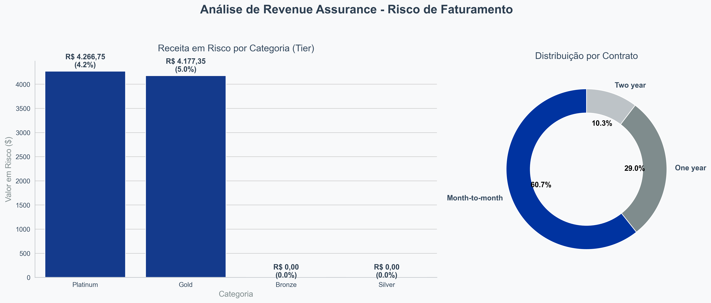

# 📊 Telecom Revenue Assurance: Identificação de Vazamento de Receita

Este projeto simula um cenário real de **Garantia de Receita (Revenue Assurance)** em uma operadora de telecomunicações. O objetivo principal é identificar a **Base de Oportunidade**: clientes ativos de alto valor (Tiers Platinum e Gold) que possuem serviços de fibra óptica, mas que apresentam falhas de faturamento ou descompasso de integração com sistemas parceiros.

## 🎯 O Problema de Negócio
Em grandes operações, é comum que clientes ativos não sejam integrados corretamente a painéis de serviços de terceiros ou segurança, resultando em "vazamento de receita" (Revenue Leakage). O desafio foi construir um pipeline que:
1. **Segmentasse a base** por tempo de permanência e valor de fatura.
2. **Identificasse anomalias** de preço (clientes pagando >20% acima da média do grupo).
3. **Cruzasse dados** entre o banco principal e o painel do parceiro para isolar alvos críticos.

## 🛠️ Tech Stack & Ferramentas
* **SQL (Google BigQuery):** Processamento em nuvem utilizando CTEs, Window Functions e tipos de dados de alta precisão (`NUMERIC`).
* **Python (Pandas):** Replicação da lógica de ETL e manipulação de DataFrames via `.transform()`.
* **Visualização (Matplotlib/Seaborn):** Geração de dashboard executivo automatizado.
* **Cloud:** Google Cloud Platform (GCP).

## 🔀 Fluxo de Dados (Pipeline)
A solução foi desenvolvida em duas frentes complementares para garantir a integridade dos resultados:

### 1. Engine de Dados (SQL/GCP)
A query SQL foi estruturada para ser executada em ambiente de BigQuery, utilizando boas práticas de performance:
* **CTEs:** Organização lógica do faturamento e filtragem de churn.
* **Window Functions:** Cálculo de médias móveis por categoria de contrato e serviço de internet para detectar outliers de preço.
* **Data Integrity:** Uso de conversão para inteiros/numeric para evitar perda de precisão decimal em cálculos financeiros.

> 📂 Arquivo: `revenue_leakage_analysis.sql`

### 2. Automação e Visualização (Python)
O script Python reproduz o pipeline de dados e automatiza a geração de insights visuais para a diretoria.
* Implementação de lógica condicional complexa via `numpy.select`.
* Cálculo de exposição de risco proporcional à receita total.

> 📂 Arquivo: `etl_pandas_visual.py`

## 📈 Resultados e Insights
O dashboard gerado destaca o risco financeiro concentrado por categoria de cliente (Tier) e tipo de contrato, permitindo ações rápidas de retenção e correção de faturamento.

### Principais Regras de Negócio Aplicadas:
* **Alvo Crítico:** Cliente Platinum/Gold + Sem Suporte Técnico + Sem Segurança Online + Fora do Painel Parceiro.
* **Financeiro:** Normalização de casas decimais para padrão BRL (R$) e análise de exposição percentual.

---

**Desenvolvido por Felipe Palmeira**
*Especialista em Análise de Dados e Sistemas de Telecomunicações.*